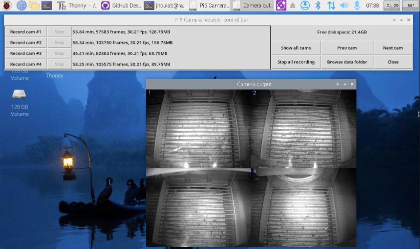

# HOW TO USE:

Instructions, version 1.5, Updated March 10, 2025.

This is intended to run on a Raspberry Pi 5, which is much faster than the Pi 4. It
can handle 4 simultaneous cameras at 640x480 resolution and 30 frames per second.

It will run on an older Pi 4 (slowly), and is best suited for controlling a single camera.

If you have problems, questions, or suggestions, please email jhoulab1@gmail.com

# GETTING STARTED:

To install on a new machine, follow the instructions at the bottom of this page, under: "Installing on Raspberry Pi 5".

On most JhouLab Pi's, the program is already installed to the following folder:

    /home/jhoulab/Documents/github/Pi5WebcamRecorder

Once installed, launch the program with one of the following methods:

    Method 1: From command line:

      cd ~/Documents/github/Pi5WebcamRecorder
      python -m RUN_AS_ROOT

    Method 2: From the Pi's built-in Thonny app:
      Click "Load", select "RUN_AS_ROOT.py", then click "Run" (green button with white triangle).

Upon launch, the program will auto-detect USB cameras, open a control bar, and display up to 4 cameras in a 2x2 grid,
like below:

Cameras plugged into any of the four USB ports will show up on the screen in the following positions:

    -------------
    |  1  |  2  |
    -------------
    |  3  |  4  |
    -------------

The program will show a bar at the top with buttons to start/stop recording. You can also control recording
from external GPIO logic inputs (see "GPIO PROTOCOL" section below).

By default, videos save to the program directory, but I recommend you
change this to an external drive, to avoid filling up your SD card.
This is done by creating/editing a config.txt file (see CONFIGURING section below).

Default video format is 640x480, 30fps, with h264 encoding. These can also be
changed in config.txt.

Each recording session generates three files, with the following names and contents:

    YYYY-MM-DD_HHmm_CamX_AnimalID_Video.avi     # Video file in h264 format.
    YYYY-MM-DD_HHmm_CamX_AnimalID_Frames.txt    # Tab-delimited text file with timestamps of each video frame
    YYYY-MM-DD_HHmm_CamX_AnimalID_TTLs.txt      # Tab-delimited text file with timestamps of each TTL pulse

In the above filenames, YYYY-MM-DD_HHmm is the date and time, X is the camera number (1-4), and AnimalID is entered
manually or transmitted via GPIO logic inputs.

h264 codec is pretty efficient. Files are typically about 2MB/min, or 33kB/sec. This will reach 1GB after about 6-8 hours.

# CONFIGURING:

Many default parameters can be changed using a "config.txt" text file. I've included two working examples:

    config_example1     A detailed file with all possible configuration options
    config_example2     A bare-bones file with only the most commonly used options.

To use either file, open it in any text editor, resave it as "config.txt", then edit to suit your needs.
Changes to "config.txt" take effect only after restarting the program. Options include the following:

    RECORD_FRAME_RATE            # Frame rate of recorded video. If not specified, defaults to camera's native frame rate, typically 30fps
    NATIVE_FRAME_RATE            # Native frame rate of webcam. If not specified, will be auto-detected.
    DATA_FOLDER                  # Folder for saving. If not specified, defaults to program directory.
    RESOLUTION                   # A string of the form: (width,height), e.g. (640x480)
    FOURCC                       # Recording codec. Default h264 which gives smallest file sizes. Can also use mp4v, which is less CPU intensive, but gives larger files

# GPIO TIMING PROTOCOL

Pi5WebcamRecorder monitors GPIO inputs 4 through 7, corresponding to the following cameras:

    GPIO4:          camera 1
    GPIO5:          camera 2
    GPIO6:          camera 3
    GPIO7:          camera 4

These are 3.3V inputs, so you must use a level shifter when connecting to 5V devices. If you use Med-PC
to generate timing signals, remember that those are 28V signals, which require an additional
voltage shifter (purchased from Med Associates) to convert from 28V to 5V, which in turn is converted to 3.3V
through the level-shifter, i.e. you will need to devices. Setting these up requires some
familiarity with electronics.

Sending two consecutive 100ms pulses (with a 50ms pause in between) will start a recording, as follows:

            100ms  100ms
    3.3V     ___    ___      
            |   |  |   |    
    0V -----     --     --------
                50ms

Once a session is started, three consecutive 100ms pulses will stop the recording:

            100ms  100ms  100ms
    3.3V     ___    ___    ___    
            |   |  |   |  |   |
    0V -----     --     --     ----
                50ms    50ms

While a recording is ongoing, any single 100ms pulse will be recorded in the *_TTLs.txt file.
The pulse will look like this:

            100ms
    3.3V     ___ 
            |   |
    0V -----     ----------

The contents of the *_TTLs.txt file will be tab-delimited, and will will have three columns,
corresponding to event number, onset time, and offset time:

    TTL_event_number	ONSET (seconds)	OFFSET (seconds)
    1	19.604753732681274	19.708051204681396
    2	155.62897396087646	155.73339176177979
    3	411.64712834358215	411.75243949890137
    4	607.6641576290131	607.7683758735657
    5	803.6808965206146	803.7854342460632
    6	1059.6991975307465	1059.8032557964325

With all pulses, the allowable range is 50-150ms, but it is recommended not to get too close to
the endpoints of this range, as errors can occur due to Linux not being a real-time operating system.

You can also transmit an animal ID number via the GPIO pins as a 16-bit binary number.
The ID number has to be transmitted BEFORE starting the session, and will show up
in the filename and on the screen during recording.

If you transmit the ID after a session has already started, it will likely
get interpreted as a triple pulse, which will stop the recording. So don't do that.

ID transmission begins with a 300ms pulse, followed by 16 binary bits as shown below:

    3.3V      300ms  <16 binary bits, 50 or 150ms each>            <Parity bit 50 or 150ms long>
             ______   _   _   ___   _   ___                 _       _
            |      | | | | | |   | | | |   |  .. etc..     | |     | |
    0V -----        -   -   -     -   -     -             -   -----   ---------------
                      50ms between ID bits                    200ms pause before parity bit

The bit order is MOST significant bit first, 50ms pulse for "0" and 150ms pulse for "1", and 50ms gaps between pulses.
The final checksum parity bit is 50ms duration if the preceding ID had an even number of "1"s, 150ms duration if odd.

# KNOWN SHORTCOMINGS:

1. The last frame of video may not be recorded to the hard drive. This appears to be a bug in FFMPEG, which OpenCV uses.

2. On Windows, it is convenient to use ImageJ/FIJI to quickly view videos, but this does not appear
   to work on the Raspberry Pi, again due to issues with FFMPEG. A cumbersome workaround is to decompress video using:
     
         ffmpeg input.avi -c:v rawvideo output.avi

#  INSTALLING ON RASPBERRY PI 5:

To install, follow these three steps:

### STEP 1: Clone the github repository.

  There are two ways to do this:

  #### Method 1: From command prompt:
    
    git clone https://github.com/JhouLab/Pi5WebcamRecorder

  #### Method 2: Using Github Desktop: https://pi-apps.io/install-app/install-github-desktop-on-raspberry-pi/

  First install Pi-Apps:

    wget -qO- https://raw.githubusercontent.com/Botspot/pi-apps/master/install | bash

  Launch Pi-Apps, select "Programming", "Github Desktop" (the purple cat icon), and
  click "Install". It will take a couple of minutes. Then launch Github from the main Raspberry Pi menu,
  under "Accessories", then log into the lab github account. Then select "File",
  "Clone repository", "Github.com", "JhouLab/Pi5WebcamRecorder":

  Github Desktop only works on Pis running a 64-bit os. If you are running a 32-bit
  os, it may still install, but graphics will be weird and unusable.

## STEP 2: Install OpenCV.

  From the command prompt, type the following:

    sudo apt-get install libopencv-dev
    sudo apt-get install python3-opencv

  As of 6/12/2024, this installs OpenCV version 4.6.0, which is outdated (released 6/12/2022),
  but works well enough. For other ways to install OpenCV, see here:
  https://qengineering.eu/install%20opencv%20on%20raspberry%20pi%205.html

## STEP 3: Install rpi-lpgio (only needed if controlling from external GPIOs)
  Annoyingly, the Pi5 uses different GPIO hardware than the Pi4, but the default GPIO library still assumes
  the old hardware. To work around this, use the following two commands to replace the standard library
  with python3-rpi-lpgio, a drop-in replacement:

    sudo apt remove  python3-rpi.gpio
    sudo apt install python3-rpi-lgpio

At this point, you should be able to launch the app and see live video on the screen.

## Experimental: add tailscale access to SMB server for file storage

From the command line, install tailscale, and then start it:

    curl -fsSL https://tailscale.com/install.sh | sh
    sudo tailscale up

When you run this, it should open a firefox window into which you should log into the lab tailscale account.

After this, it will automatically reconnect when rebooting Pi, and you don't need to restart it again.

Optional: can use this to prevent tailscale up from requiring sudo

	sudo tailscale set --operator=$USER

Now install smb client, and create a new folder:

	apt-get install  samba-common smbclient samba-common-bin smbclient  cifs-utils
	mkdir /mnt/smb

Mount shared folder. Must do this every time Pi is restarted:

	sudo mount -t cifs //labunraid/zfs48_share /mnt/smb -o user=tomjhou,pass=ithaca55
	

  

